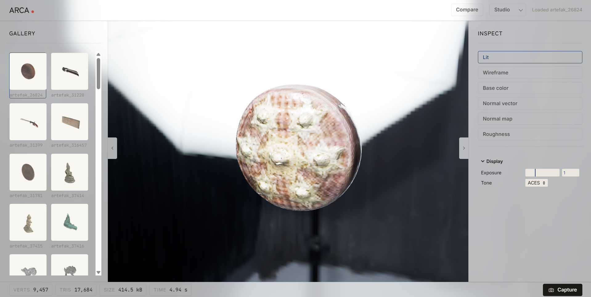

<div align="center">

# ARCA

Interactive 3D viewer for Indonesian cultural artifacts reconstructed from a single photograph.

[](https://vitejs.dev/)
[](https://threejs.org/)
[](https://developer.mozilla.org/en-US/docs/Web/JavaScript)
[](https://huggingface.co/spaces/lumicero/arca)
[](LICENSE)

[**Live demo**](https://huggingface.co/spaces/lumicero/arca) · [3D File Generation Notebook](https://github.com/eycoo/FP_GRAFKOM) · [Report an issue](https://github.com/luminolous/arca/issues)

<br />



</div>

---

## About

ARCA is a static web viewer for 3D reconstructions of Indonesian cultural artifacts. The reconstructions come from a separate Stable Fast 3D pipeline that takes one photograph per artifact and writes a GLB file. ARCA loads those files in the browser so you can rotate the model, swap the lighting, inspect the materials, and export screenshots.

The viewer does not run any inference. What you see is exactly what the reconstruction pipeline produced. A reconstruction from a single photo is approximate by definition, and the inspect modes are there to make those approximations visible: a flat normal map, a wireframe, a base color view without lighting. The HDRI presets let you check how the material reads against different lighting environments before deciding whether a particular reconstruction is good enough to ship.

## Features

- Load any GLB from the artifact set. The camera auto-fits to the bounding sphere and OrbitControls handles rotate, zoom, and pan.
- Three HDRI environment presets, all from Poly Haven: studio, outdoor, museum. Image-based lighting via PMREM. Switching is instant after the first load because environments are cached.
- Inspect modes for lit, wireframe, base color, normal vector, normal map, and roughness. Swapped materials are disposed on switch so memory stays bounded.
- Gallery rail with one thumbnail per artifact. Click to swap the loaded model.
- Side-by-side compare two artifacts with optional camera sync, so the same orbit lands in the same orientation on both panes.
- Exposure slider (0.2 to 3.0) and tone mapping select (ACES, Reinhard, Linear) in a lil-gui panel.
- Metadata pills showing vertex count, triangle count, file size, and reconstruction time pulled from the asset manifest.
- PNG screenshot at 2x viewport resolution, named `<stem>_<view>.png`.
- Every view setting round-trips through the URL, so a copied address restores the same camera, lighting, and inspect mode in a fresh tab.
- Collapsible gallery and inspect rails so the artifact can take the full stage.

## Tech stack

| Layer | Choice | Why |
|-------|--------|-----|
| Frontend | Vanilla JavaScript, Vite, hand-written CSS | The viewer is one HTML file and a handful of ES modules. No framework, no CSS utility kit, no build complexity beyond what Vite gives for free. |
| 3D | Three.js r170, official examples (GLTFLoader, DRACOLoader, KTX2Loader, RGBELoader, OrbitControls, PMREMGenerator) | The whole 3D stack is examples-jsm. No `three-stdlib`, no React reconciler. |
| Controls | lil-gui | A single small library covers the exposure and tone mapping panel without dragging in a UI framework. |
| Data | Static `public/manifest.json` and WebP thumbnails generated offline | No backend. The notebook produces every derived asset the viewer reads. |
| Deploy | Hugging Face Space, `sdk: static`, pushed by a GitHub Action | Free static hosting, the Space repository tracks `dist/`, and the source of truth stays on GitHub. |

## Project layout

```
index.html          single-page entry
vite.config.js
src/
  main.js           renderer, pane orchestration, control wiring
  viewer.js         GLB load, camera fit, OrbitControls
  lighting.js       PMREM environment + HDRI switcher
  inspect.js        wireframe + material-map swaps
  compare.js        camera sync for side-by-side panes
  gallery.js        thumbnail grid, click-to-load
  metadata.js       bottom-bar pill populator
  screenshot.js     2x PNG export
  url-state.js      shareable URL read/write
  style.css         all styles
public/
  models/           GLB inputs from the reconstruction pipeline
  hdri/             Poly Haven environment maps
  thumbnails/       generated by notebook 01
  manifest.json     generated by notebook 01
  stats.json        generated by notebook 01
  images/           preview asset for this README
notebooks/
  01_offline_assets.ipynb       parse manifest, render thumbnails, compute stats
  02_screenshot_batch.ipynb     Playwright batch capture for downstream evaluation
.github/workflows/
  deploy-hf.yml     build and push dist/ to the Hugging Face Space on every commit to main
```

## Acknowledgments

- Notebook / pipeline for dataset preprocessing and 3D file generation: [eycoo/FP_GRAFKOM](https://github.com/eycoo/FP_GRAFKOM)
- Upstream model: [Stable Fast 3D](https://github.com/Stability-AI/stable-fast-3d) by Stability AI
- HDRI environments: [Poly Haven](https://polyhaven.com) under CC0
- 3D engine and loaders: [Three.js](https://threejs.org/) and its `examples/jsm` collection
- GUI: [lil-gui](https://github.com/georgealways/lil-gui)
- Headless capture for batch screenshots: [Playwright](https://playwright.dev/)

## License

Released under the MIT license. See [LICENSE](LICENSE).
